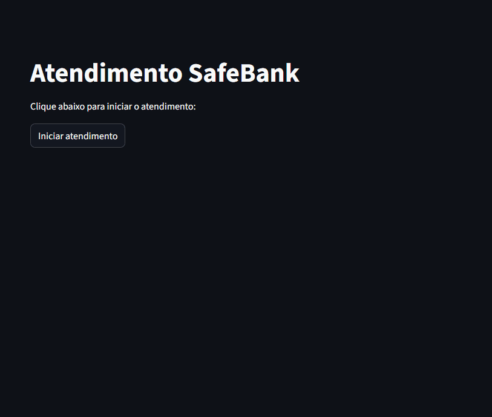

# 🤖 Atendimento e Suporte — Chatbot com RAG

Aplicação de **Inteligência Artificial para atendimento automatizado** que utiliza **RAG (Retrieval-Augmented Generation)** para responder perguntas com base em **documentos reais da empresa**, como manuais, FAQs e bases de conhecimento.

O projeto demonstra como construir um **chatbot corporativo baseado em conhecimento**, capaz de reduzir o volume de atendimentos repetitivos e melhorar o tempo de resposta ao cliente.

Este projeto foi desenvolvido com foco em **arquitetura moderna de aplicações com LLMs**, sendo adequado como **case de portfólio em IA aplicada**.

## 🎬 Demo


---

# 🎯 Problema

Equipes de suporte frequentemente enfrentam:

- Alto volume de perguntas repetitivas
- Sobrecarga de atendentes humanos
- Tempo de resposta elevado
- Clientes que preferem perguntar diretamente ao suporte em vez de consultar documentação

Mesmo quando empresas possuem **documentação bem estruturada**, muitos usuários optam por abrir chats ou tickets.

Isso gera:

- custo operacional elevado
- baixa eficiência operacional
- experiência de usuário prejudicada

---

# 💡 Solução

Este projeto implementa um **Chatbot com RAG**, onde o modelo de linguagem responde perguntas **baseado em documentos internos da empresa**.

Diferente de um chatbot tradicional:

1️⃣ O sistema busca informações relevantes nos documentos  
2️⃣ Recupera os trechos mais relacionados à pergunta  
3️⃣ Envia esses trechos como contexto para o LLM  
4️⃣ O modelo gera a resposta final baseada nesse contexto

Isso torna o chatbot **mais confiável e contextualizado**, evitando respostas genéricas.

---

# ✨ Funcionalidades

- Chatbot de atendimento automatizado
- Respostas baseadas em documentos da empresa
- Busca semântica por similaridade
- Indexação vetorial com FAISS
- Suporte a múltiplos documentos PDF
- Interface web interativa
- Histórico de conversa na sessão
- Pipeline RAG modular

---

# 🛠 Tecnologias Utilizadas

### Python
Linguagem principal utilizada para toda a aplicação.

### Streamlit
Framework Python que permite criar **interfaces web interativas rapidamente**, ideal para protótipos e aplicações de IA.

### LangChain
Framework utilizado para construir a **pipeline RAG**, conectando:
- carregamento de documentos
- geração de embeddings
- recuperação de contexto
- geração de respostas

### FAISS
Biblioteca criada pela Meta para **busca eficiente por similaridade entre vetores**.
Armazena os embeddings dos documentos e retorna os mais relevantes.

### HuggingFace
Plataforma utilizada para obter o modelo de embeddings:

---

## Como executar o projeto
1. Clone o repositório
2. Crie e ative a venv:
   ```bash
   python -m venv venv
   venv\Scripts\activate  # Windows
   ```
3. Instale as dependências:
   ```bash
   pip install -r requirements.txt
   ```
   > Desenvolvido com Python 3.11. Para reprodução exata do ambiente use: 
   > ```bash
   > pip install -r requirements-freeze.txt
   > ```

4. Crie o arquivo `.env` com sua chave Groq:
   ```
   GROQ_API_KEY=sua_chave_aqui
   ```
5. Adicione PDFs na pasta `content/`
6. Execute:
   ```bash
   streamlit run main.py
   ```

## Estrutura do projeto

```
├── app/
│   ├── __init__.py
│   ├── llm.py               # Carregamento do modelo LLM
│   ├── retriever.py         # Extração de PDF, chunks e indexação FAISS
│   └── rag_chain.py         # Chain RAG e interação com o chat
├── content/                 # PDFs da base de conhecimento (não versionado)
├── index_faiss/             # Índice vetorial gerado (não versionado)
├── docs/
│   ├── conceitos.md         # Explicação dos conceitos do projeto
│   └── cenario.md           # Contexto e justificativa do projeto
├── main.py                  # Interface Streamlit e fluxo principal
├── requirements.txt         # Dependências diretas
├── requirements-freeze.txt  # Versões exatas de todas as dependências
├── .env                     # Chave da API (não versionado)
└── .gitignore
```

## Tecnologias

- [Streamlit](https://streamlit.io/) — Interface web
- [LangChain](https://langchain.com/) — Framework para LLMs
- [Groq](https://groq.com/) — API do modelo LLaMA (Meta), rodando em LPU
- [FAISS](https://faiss.ai/) — Banco vetorial local
- [HuggingFace](https://huggingface.co/) — Modelo de embeddings em português

---
# 👨‍💻 Autor

**Endrew Silva**  

Desenvolvedor Python | Inteligência Artificial | Automação

GitHub  
https://github.com/silvaEndrew1

LinkedIn  
https://www.linkedin.com/in/endrew-silva-14734914a/

---
